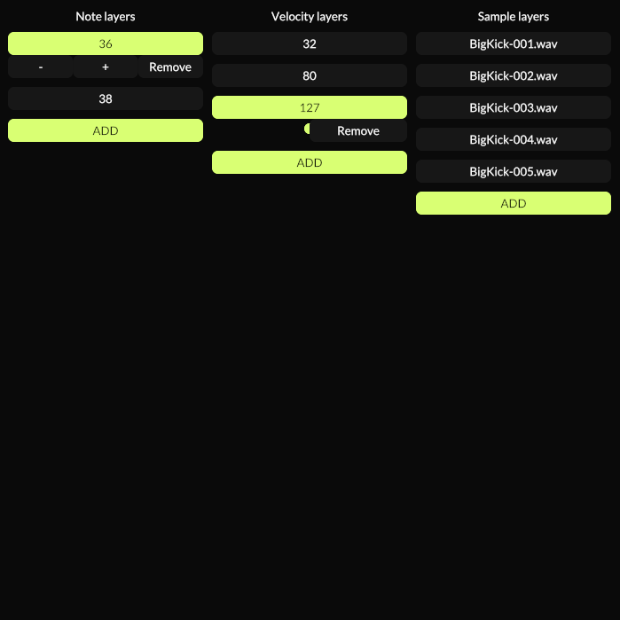

# Nih-Sampler

A simple sampler written with [nih-plug](https://github.com/robbert-vdh/nih-plug.git).

Run with:

`cargo xtask bundle nih-sampler`

# TODO:
- update UI
- perhaps add features to not have to use multiple instances of the plugin (like the old version)
- add min/max volume settings
- add resampling
- add different channel config support
