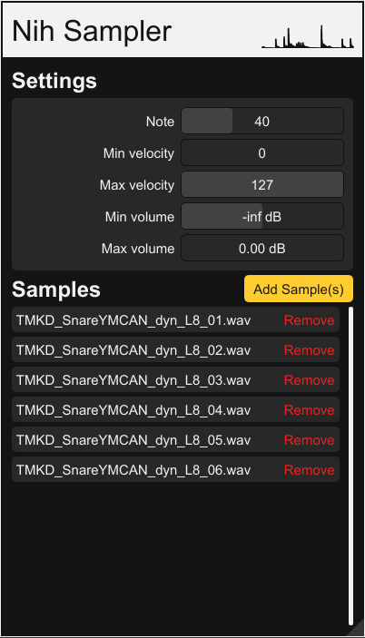

# Nih-Sampler

A simple sampler written with [nih-plug](https://github.com/robbert-vdh/nih-plug.git) and [iced_baseview](https://github.com/BillyDM/iced_baseview.git).

Run with:

`cargo xtask bundle nih-sampler`

The way this plugin works is by using nested maps.

First, there is the note map: A single note that maps to a note layer.
Each note layer has a velocity map: This maps a max velocity to a velocity layer.
Finally, each velocity layer has a sample map, which is just a list of samples, one of which is chosen randomly each time it's played.

## TODO:
- Create a better UI Design
- Volume range on velocity layers
- Implement volume option on sample layers
